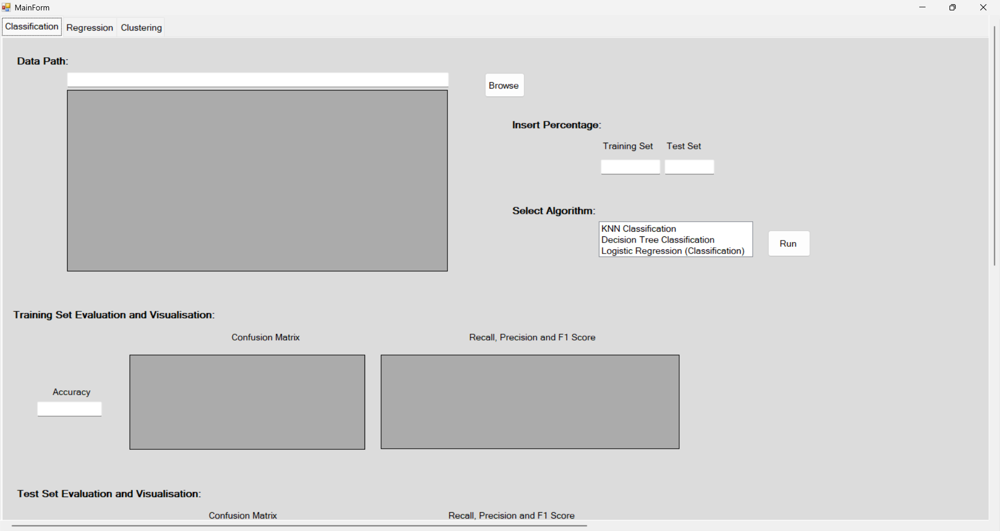
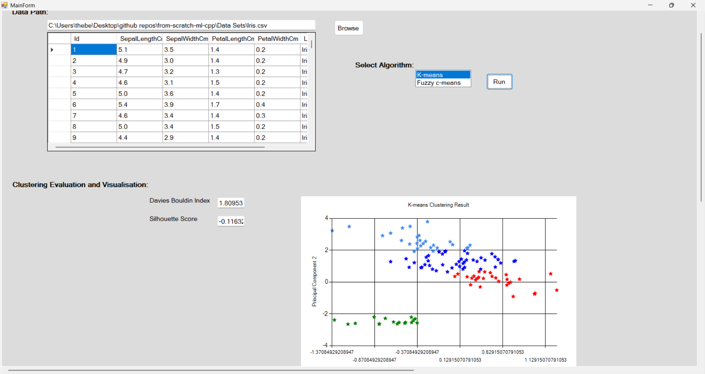
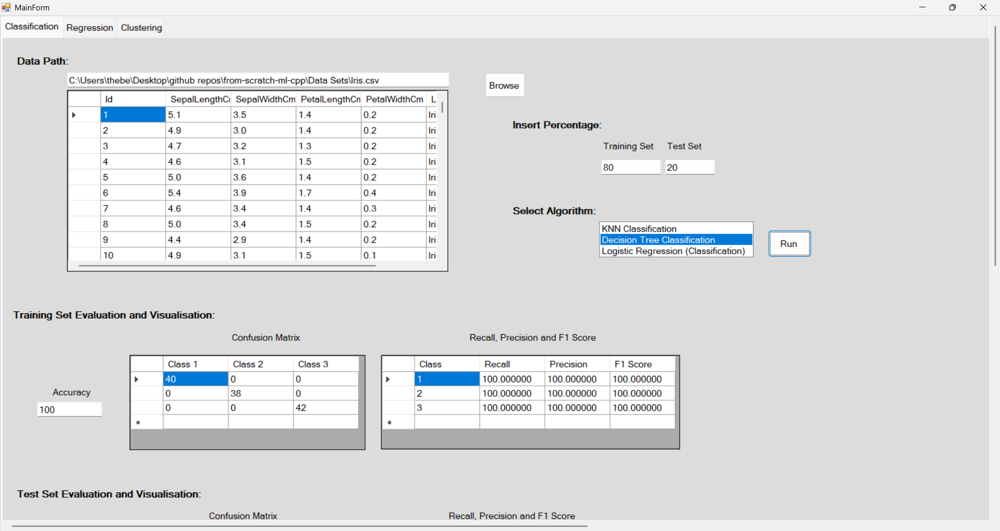

# from-scratch-ml-cpp

From-scratch C++ machine learning desktop lab with a WinForms UI, implementing core classification, regression, and clustering algorithms with evaluation metrics and 2D PCA visualization.

## Project goals

- Implement classic ML algorithms manually (no high-level ML framework dependencies).
- Compare model behavior across tasks in one desktop interface.
- Practice algorithm implementation, data processing, and software engineering discipline.

## Academic provenance

This project started from a lab starter package provided in a university machine learning course.

My work in this repository focuses on improving that baseline through:

- algorithm fixes and correctness improvements
- refactoring and code quality cleanup
- stronger validation and edge-case handling
- clearer documentation and maintainability upgrades

The goal of this repo is to document iterative engineering improvement over time.

## Architecture

The application uses a modular code organization: algorithm implementations live under task-specific modules (classification, regression, clustering), while shared concerns such as loading, preprocessing, metrics, and utilities are separated into dedicated components. Most model flows follow a consistent pipeline of load → split → fit → predict → evaluate, coordinated by the desktop UI layer.

## Implemented algorithms

### Classification
- K-Nearest Neighbors (`KNNClassifier`)
- Logistic Regression (`LogisticRegression`)
- Decision Tree Classification (`DecisionTreeClassification`)

### Regression
- Linear Regression (`LinearRegression`)
- K-Nearest Neighbors Regression (`KNNRegression`)
- Decision Tree Regression (`DecisionTreeRegression`)

### Clustering
- K-Means (`KMeans`)
- Fuzzy C-Means (`FuzzyCMeans`)

## Evaluation implemented

### Classification metrics
- Accuracy
- Precision
- Recall
- F1 Score
- Confusion Matrix

### Regression metrics
- Mean Absolute Error (MAE)
- Root Mean Squared Error (RMSE)
- R-squared ($R^2$)

### Clustering metrics
- Silhouette Score
- Davies-Bouldin Index

## Tech stack

- C++ / C++ CLI
- Windows Forms (desktop UI)
- Eigen 3.4.0 (linear algebra / PCA)
- Visual Studio 2022 solution + VS Code task support

## Build and run

### Option 1: Visual Studio
1. Open `MachineLearningLab.sln` in Visual Studio 2022.
2. Select `Debug | x64` (or `Release | x64`).
3. Build and run `MachineLearningLab`.

### Option 2: VS Code task
Run the task:

- `Build MachineLearningLab (Debug x64)`

This project includes build helpers in `.vscode/build-solution.ps1`.

## Dataset expectations

- CSV input is expected by the UI workflows.
- The last column is treated as the target/label for supervised tasks.
- Some paths currently include dataset-specific preprocessing assumptions (part of ongoing refactor work).

## Repository structure

- `MachineLearningLab/src/Classification` → classification algorithms
- `MachineLearningLab/src/Regression` → regression algorithms
- `MachineLearningLab/src/Clustering` → clustering algorithms
- `MachineLearningLab/src/Evaluation` → metric implementations
- `MachineLearningLab/src/DataUtils` → loading and preprocessing
- `MachineLearningLab/src/Utils` → shared utilities (distance, entropy, PCA, tree nodes)

## Screenshots

Add screenshots here to make the project easier to evaluate quickly:

- Main desktop UI
- PCA visualization output
- Confusion matrix / evaluation output

Example markdown image embeds:

## Current engineering focus

This repository is under active iterative improvement with commit-by-commit hardening:

- API correctness and header cleanup
- Input validation and edge-case handling
- Metric correctness and robustness
- Deterministic behavior and refactoring for maintainability

## Why this project

This is a learning-by-building lab focused on algorithm understanding and software quality progression, not just final model performance.